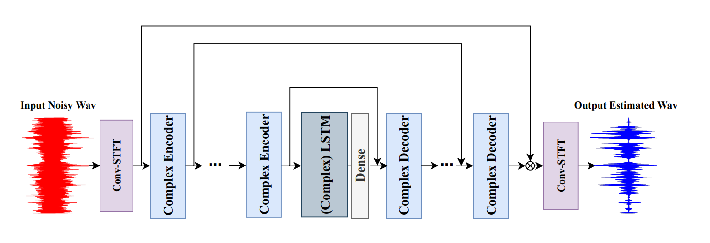
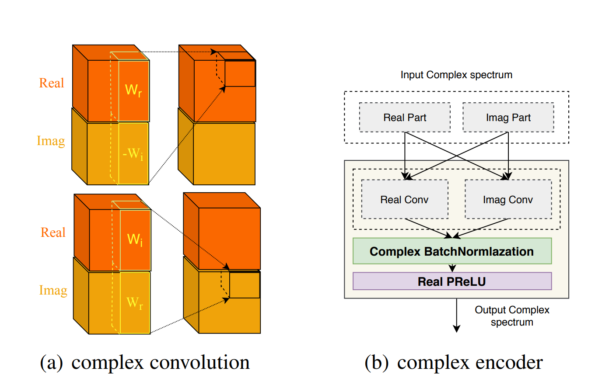

# Speech Denoising model
Проект для шумоподавления в звуке с помощью Wave-Net. Сравнение результатов для Si-SDR and Si-SDR+PESQ лоссов.

## Структура проекта
- notebooks/ - Jupyter-ноутбуки с исследованиями и пайплайнами
- models/ - Предобученные модели
- examples/ - примеры шумоподавления в звуках

## Использование
Основные ноутбуки:
- denoising_si-sdr.ipynb - Обучение и тестирование модели на основе si-sdr loss
- denoised_si-sdr_pesq_07.ipynb - Обучение и тестирование модели на основе si-sdr+pesq loss с alpha=0.7
- si-sdr_pesq_model_tuned.ipynb - Обучение и тестирование fine-tuned модели на основе si-sdr+pesq loss
- dccrn-model.ipynb - Обучение dccrn модели на si-sdr loss
- dccrn-model-tuned.ipynb - Дообучение dccrn модели на si-sdr+pesq loss

## Модели
- si-sdr_model.pt
- si-sdr_pesq_model.pt
- si-sdr_pesq_model_tuned.pt
- dccrn_model.pt

## Dataset
В качестве датасета использован Libri Speech Noise Dataset.

Для train датасета из каждого сэмпла выбирается случайные cnt_seconds секунд и модель тренируется на них.

## Si-SDR model
В качестве модели использован WaveNet c 12 down- и up- sampling.

В результате получили следующие метрики:

Test SI-SDR: 8.529809951782227, Test PESQ: 1.3428624216526268

Несколько примеров:

Noised:

[First noised sound](https://gabalpha.github.io/read-audio/?p=https://raw.githubusercontent.com/mcaramba563/denosising_model/refs/heads/main/examples/si_sdr/1-noise.wav)

[Second noised sound](https://gabalpha.github.io/read-audio/?p=https://raw.githubusercontent.com/mcaramba563/denosising_model/refs/heads/main/examples/si_sdr/2-noise.wav)

Clear:

[First clear sound](https://gabalpha.github.io/read-audio/?p=https://raw.githubusercontent.com/mcaramba563/denosising_model/refs/heads/main/examples/si_sdr/1-clear.wav)

[Second clear sound](https://gabalpha.github.io/read-audio/?p=https://raw.githubusercontent.com/mcaramba563/denosising_model/refs/heads/main/examples/si_sdr/2-clear.wav)

Слышно, что после шумоподавления присутствует много артефактов

## Si-SDR_PESQ model
Здесь использован лосс: L = SI-DSR_loss + alpha * PESQ_Loss

Лучшая, показавшая себя alpha равна 0.7

Test Loss: -7.4072041511535645, Test SI-SDR: 8.480247497558594, Test PESQ: 1.4842217170151453

Видно, что SI-SDR почти не упал, а PESQ увеличился на 0.14 пунктов

Также слышно, что артефактов стало меньше

Noised:

[First noised sound](https://gabalpha.github.io/read-audio/?p=https://raw.githubusercontent.com/mcaramba563/denosising_model/refs/heads/main/examples/noisy/1-noise.wav)

[Second noised sound](https://gabalpha.github.io/read-audio/?p=https://raw.githubusercontent.com/mcaramba563/denosising_model/refs/heads/main/examples/noisy/2-noise.wav)

Clear:

[First clear sound](https://gabalpha.github.io/read-audio/?p=https://raw.githubusercontent.com/mcaramba563/denosising_model/refs/heads/main/examples/si_sdr_pesq/1-clear.wav)

[Second clear sound](https://gabalpha.github.io/read-audio/?p=https://raw.githubusercontent.com/mcaramba563/denosising_model/refs/heads/main/examples/si_sdr_pesq/2-clear.wav)

## Fine-tuned Si-SDR_PESQ model
В качестве модели использован WaveNet c 10 down- и up- sampling, увеличенным F_c с 24 до 32, которая работает со звуками длиной 4 секунды.

Метрики:

Test Loss: -8.5006742477417, Test SI-SDR: 9.49311637878418, Test PESQ: 1.5889746858014002

По сравнения с предыдущей моделью Si-SDR_PESQ(с 12 слоями) PESQ увеличился на 0.1, а SI-SDR более чем на 1 дб

Артефактов стало еще меньше

Noised:

[First noised sound](https://gabalpha.github.io/read-audio/?p=https://raw.githubusercontent.com/mcaramba563/denosising_model/refs/heads/main/examples/noisy/1-noise.wav)

[Second noised sound](https://gabalpha.github.io/read-audio/?p=https://raw.githubusercontent.com/mcaramba563/denosising_model/refs/heads/main/examples/noisy/2-noise.wav)

Clear:

[First clear sound](https://gabalpha.github.io/read-audio/?p=https://raw.githubusercontent.com/mcaramba563/denosising_model/refs/heads/main/examples/si_sdr_pesq_tuned/1-clear.wav)

[Second clear sound](https://gabalpha.github.io/read-audio/?p=https://raw.githubusercontent.com/mcaramba563/denosising_model/refs/heads/main/examples/si_sdr_pesq_tuned/2-clear.wav)

## DCCRN Model

То есть данная модель работает с sftf представлением звука, использует 2d Complex Unet и GRU в качестве backbone.
Обучили сначала на si-sdr loss, а потом дообучили на si-sdr+pesq loss с alpha=0.7(при этом PESQ вырос на 0.7, а Test SI-SDR еще на 0.2)
По сравнению с WaveNet Test SI-SDR увеличился более чем на 10%, как и PESQ

Метрики на тестовой выборке:

Test Loss: -10.03722095489502, Test SI-SDR: 10.769451141357422, Test PESQ: 1.7253217785131363

На примерах слышно, что качество выросло

Noised:

[First noised sound](https://gabalpha.github.io/read-audio/?p=https://raw.githubusercontent.com/mcaramba563/denosising_model/refs/heads/main/examples/noisy/1-noise.wav)

[Second noised sound](https://gabalpha.github.io/read-audio/?p=https://raw.githubusercontent.com/mcaramba563/denosising_model/refs/heads/main/examples/noisy/2-noise.wav)

Clear:

[First clear sound](https://gabalpha.github.io/read-audio/?p=https://raw.githubusercontent.com/mcaramba563/denosising_model/refs/heads/main/examples/dccrn/1-clear.wav)

[Second clear sound](https://gabalpha.github.io/read-audio/?p=https://raw.githubusercontent.com/mcaramba563/denosising_model/refs/heads/main/examples/dccrn/2-clear.wav)
